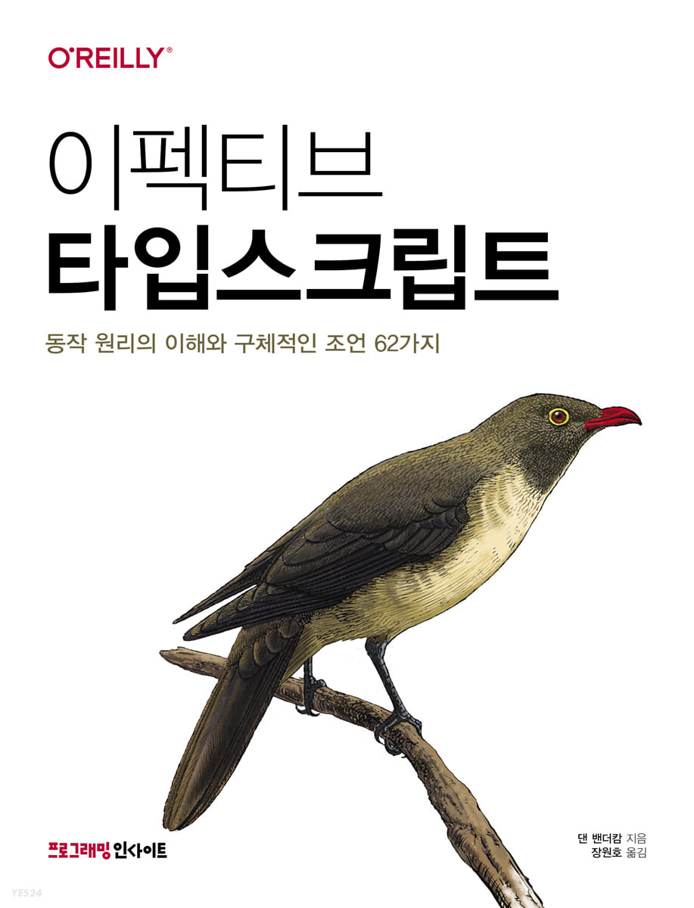

# TypeScript Study

- 개요 : TypeScript 공부
- 시작 : 2023.05.30 ~

## Reference

## Guide

- [타입 스크립트와 자바스크립트의 관계](https://github.com/ohtaekwon/Frontend-101/blob/main/TypeScript/EffectiveTypeScript/01.%ED%83%80%EC%9E%85%EC%8A%A4%ED%81%AC%EB%A6%BD%ED%8A%B8%20%EC%95%8C%EC%95%84%EB%B3%B4%EA%B8%B0/Item01_%ED%83%80%EC%9E%85%20%EC%8A%A4%ED%81%AC%EB%A6%BD%ED%8A%B8%EC%99%80%20%EC%9E%90%EB%B0%94%EC%8A%A4%ED%81%AC%EB%A6%BD%ED%8A%B8%EC%9D%98%20%EA%B4%80%EA%B3%84%20.md)
- [타입스크립트 설정 - noImplicitAny & strictNullChecks](https://github.com/ohtaekwon/Frontend-101/blob/main/TypeScript/EffectiveTypeScript/01.%ED%83%80%EC%9E%85%EC%8A%A4%ED%81%AC%EB%A6%BD%ED%8A%B8%20%EC%95%8C%EC%95%84%EB%B3%B4%EA%B8%B0/Item02_%ED%83%80%EC%9E%85%EC%8A%A4%ED%81%AC%EB%A6%BD%ED%8A%B8%20%EC%84%A4%EC%A0%95.md)
