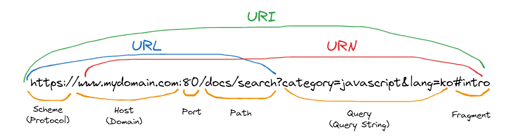

# 브라우저의 랜더링

## 01.3. 요청과 응답

브라우저의 핵심 기능은 필요한 리소스(HTML, CSS, JavaScript, 이미지, 폰트 등의 정적 파일 또는 서버가 동적으로 생성한 데이터)를 서버에 요청하고 서버로부터 응답받아 브라우저에 시각적으로 렌더링한다.

> **_Key Point💡_**
>
> 렌더링에 필요한 리소스는 모두 서버에 존재하므로, 필요한 리소스를 서버에 요청하고 서버가 응답한 리소스를 파싱하여 렌더링하는 것이다.

서버에 요청을 전송하기 위해 브라우저는 주소창을 제공하고, 주소창에 URL을 입력하여 URL의 호스트 이름이 `DNS`를 통해 IP주소로 변환되고 이 IP 주소를 갖는 서버에게 요청을 전송하도록 합니다.

> **_DNS란? 💡_**
>
> `DNS(Domain Name System)`는 인터넷 전화번호부입니다. 사람은 `예) nytimes.com` 또는 `espn.com`과 같은 도메인 이름을 통해 온라인으로 정보에 액세스합니다. 웹 브라우저는 인터넷 프로토콜(IP) 주소를 통해 상호작용합니다. DNS는 브라우저가 인터넷 자원을 로드할 수 있도록 도메인 이름을 IP 주소로 변환합니다.

- 인터넷에 연결된 각 기기에는 다른 컴퓨터가 기기를 찾는 데 사용하는 고유한 `IP` 주소가 있고, `DNS` 서버를 사용하면 사람이 `192.168.1.1(IPv4의 경우)`과 같은 `IP 주소` 또는 `2400:cb00:2048:1::c629:d7a2(IPv6의 경우)`처럼 **영문과 숫자로 된 복잡한 IP 주소를 기억할 필요가 없습니다.**

## 요약

- `DNS(Domain Name System)`는 인터넷 전화번호부로, 사람이 이해하기 쉽게 인터넷 자원을 로드할 수 있도록 IP를 주소를 변환한 것을 의미한다.
