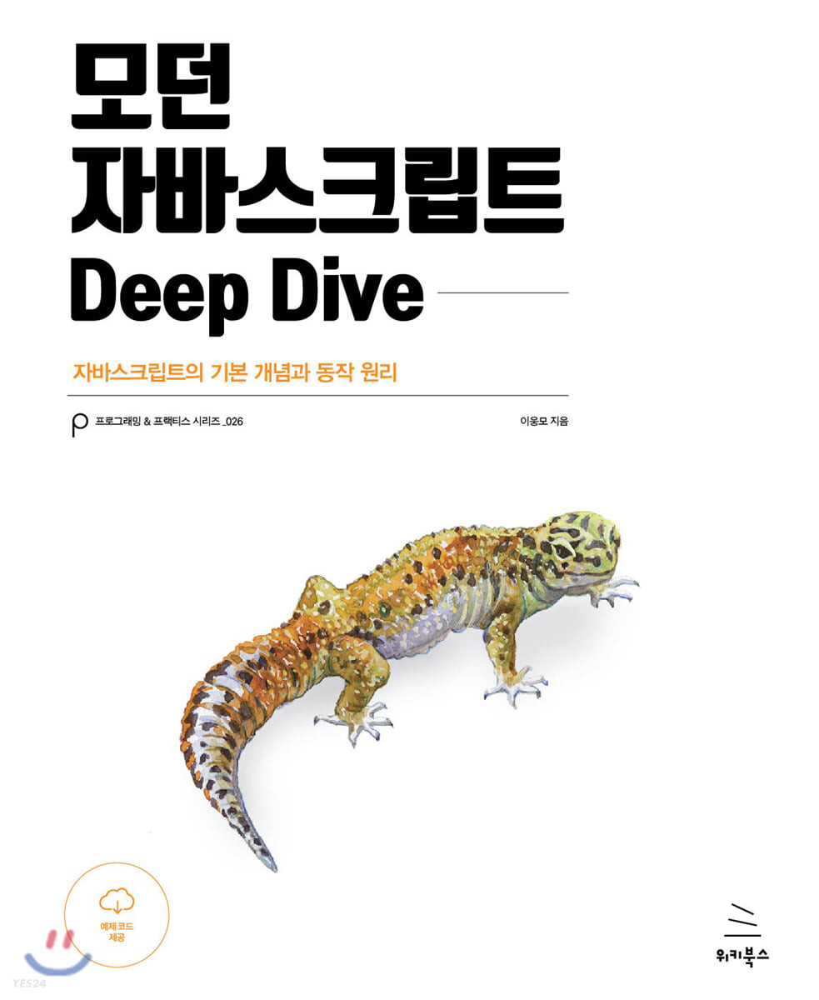

# 🟨 Learn JavaScript

## Intro

> * **개요 : <모던 자바스크립트 DeepDive>** 를공기반으로 정리하였습니다.
> * 특이사항 :  S6+ 용법 및 추가 메소드 및 기능정사항 정리
> * 시작 : 2023.05.29 \~

## Reference

* 개념 설명 -  자스크립트 DeepDive

<figure><figcaption>
자바스크립트 DeepDive
</figcaption></figure>

##

## Additional

<table><thead><tr><th width="422">구분</th><th>링크</th></tr></thead><tbody><tr><td>[ES2023] 배열과 관련된 자바스크립트 새로운 기능</td><td><a href="https://velog.io/@taetae-5/ES2023%EC%9D%98-%EC%9E%90%EB%B0%94%EC%8A%A4%ED%81%AC%EB%A6%BD%ED%8A%B8-%EC%83%88%EB%A1%9C%EC%9A%B4-%EA%B8%B0%EB%8A%A5">정리 글 바로가기</a></td></tr><tr><td></td><td></td></tr><tr><td></td><td></td></tr></tbody></table>

## Quick Links


[04.](04./)



[05.](05./)



[06.](06./)



[07.](07./)

