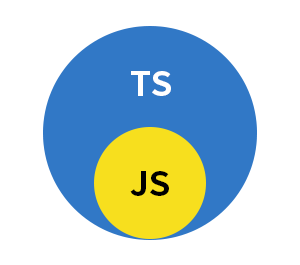
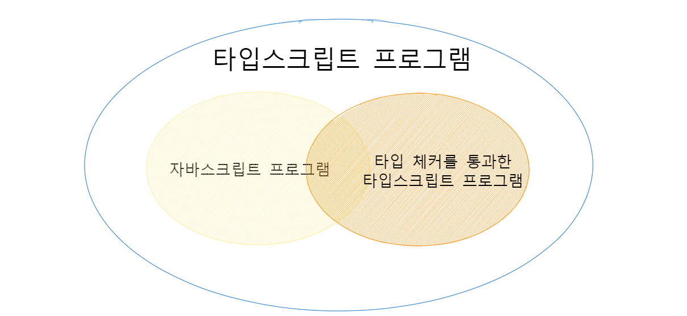

# 타입 스크립트와 자바스크립트의 관계

## 아이템 1 : 타입 스크립트와 자바스크립트의 관계 이해하기

타입스크립트는 자바스크립트의 \*\*상위 집합(superset)\*\*이다. 타입스크립트는 문법적으로도 자바스크립트의 상위집합입니다. 자바스크립트 프로그램에 문법 오류가 없다면 유효한 타입스크립트 프로그램이라고 할 수 있습니다. 그런데 자바스크립트 프로그램에 어떤 이슈가 존재한다면 문법 오류가 아니더라도 타입 체커에게 지적당할 가능성이 높습니다. 그러나 **문법의 유효성과 동작의 이슈는 독립적인 문제입니다.** 타입스크립트는 작성된 코드를 파싱하고 자바스크립트로 변환할 수 있습니다.

> **Key Point💡**
>
> **타입스크립트는 타입이 정의된 자바스크립트의 상위 집합**

자바스크립트 파일이 `.js` 또는 `.jsx`를 쓰는 반면, 타입스크립트는 `.ts` , `.tsx`확장자를 사용합니다. 그렇다고 다른 언어가 아니라, 타입스크립트는 더 상위 집합이기 때문에 `.js`파일에 있는 코드는 이미 타입스크립트라고 할 수 있습니다. 예를 들어, `main.js` 파일을 `main.ts`로 바꾼다해도 달라지는 것은 없습니다. 이러한점은 자바스크립트 코드를 타입스크립트 코드로 `마이그레이션` 하는 데 이점이 됩니다.

> **Key Point💡**
>
> 모든 자바스크립트는 타입스크립트이지만, 모든 타입스크립트는 자바스크립트가 아니다.

```ts
function great(who: string) {
  console.log("Hello", who);
}
```

위의 코드는 타입스크립트에서는 유효한 코드이지만, 자바스크립트를 구동하는 노드(node)같은 프로그램으로 앞의 코드를 실행하면 오류가 발생합니다.

```bash
// 파일 실행
node 파일명.js
```

`:string`은 타입스크립트에서 쓰이는 타입 구문입니다.

> **Key Point💡**
>
> 타입 구문을 사용하는 순간부터 자바스크립트는 타입스크립트 영역으로 들어가게 됩니다.



타입스크립트 컴파일러는 타입스크립트뿐만 아니라 일반 자바스크립트 프로그램에도 유용하다.

```ts
let city = "new york city";
console.log(city.toUppercase());
```

이 코드를 실행하면 `TypeError: city.toUppercase is not a function` 같은 오류가 발생한다.

앞의 코드에는 타입 구문이 없지만, 타입스크립트의 타입 체커는 문제점을 찾아냅니다.

> \`toUppercase' 속성이 'string' 형식에 없습니다. 'toUpperCase' 를 사용하시겠습니까?

`city`의 변수가 문자열이라는 것을 알려 주지 않아도 타입스크립트는 초깃값으로부터 **타입을 추론**합니다. 타입 추론은 타입스크립트에서 중요한 부분입니다. 타입스크립트의 목표 중 하나는 **런타임에 오류를 발생시킬 코드를 미리 찾아내는 것**입니다. 타입스크립트가 **정적** 타입 시스템이라는 것은 바로 이러한 특징을 말합니다.

오류가 발생하지는 않지만 의도와 다르게 동작하는 코드도 있습니다.

```ts
const states = [
  { name: "tk", capital: "seoul" },
  { name: "kim", capital: "incheon" },
  { name: "park", capital: "pusan" },
];

for (const state of states) {
  console.log(state.capitol);
}
```

다음의 실행 결과는

```
undefined
undefined
undefined
```

앞의 코드는 유효한 자바스크립트(또한 타입스크립트)이며, 어떠한 오류도 없이 실행이 됩니다. 그러나 루프 내의 `state.capitol`는 의도한 코드가 아닌 게 분명합니다. 이러한 경우에 타입스크립트 타입 체커는 추가적인 타입 구문 없이도 오류를 찾아냅니다.

```ts
for (const state of states) {
  console.log(state.capitol);
}
```

> 'capitol' 속성이 ... 형식에 없습니다. 'capital' 을(를) 사용하시겠습니까?

> **Key Point💡**
>
> 타입스크립트는 타입 구문 없이도 오류를 잡을 수 있지만, 타입 구문을 추가한다면 훨씬 더 많은 오류를 잡을 수 있습니다.

```ts
const states = [
  { name: "tk", capital: "seoul" },
  { name: "kim", capital: "incheon" },
  { name: "park", capital: "pusan" },
];

for (const state of states) {
  console.log(state.capital);
}
```

> 'capital' 속성이 ... 형식에 없습니다. 'capitol' 을(를) 사용하시겠습니까?

* 타입스크립트가 제시한 해결책은 잘못되었습니다. 타입스크립트는 어느쪽이 오타인지 판단하지 못합니다. 오류의 원이을 추측할 수 있지만, 항상 정확하지는 않습니다.
* 따라서, **명시적**으로 states를 **선언**하여 의도를 분명하게 하는 것이 좋습니다.

```ts
interface State {
  name: string;
  capital: string;
}
const states: State[] = [
  { name: "tk", capital: "seoul" },
  { name: "kim", capital: "incheon" },
  { name: "park", capital: "pusan" },
];

for (const state of states) {
  console.log(state.capital);
}
```

의도를 명확히 해서 타입스크립트가 잠재적 문제점을 찾을 수 있게 했습니다. 예를 들어 타입 구문 없이 배열 안에서 딱 한 번 `capitol`이라고 오타를 썼다면 오류가 되지 않았을 것입니다. 그런데 타입 구문을 추가하면 오류를 찾을 수 있습니다.

```ts
interface State {
  name: string;
  capital: string;
}
const states: State[] = [
  { name: "tk", capital: "seoul" },
  { name: "kim", capitol: "incheon" }, // 'capital'을 (를) 쓰려고 했습니까?
  { name: "park", capital: "pusan" },
];

for (const state of states) {
  console.log(state.capital);
}
```

정리하자면, 벤 다이어그램에 새로운 영역을 추가할 수 있습니다. `타입 체커를 통과한 타입스크립트 프로그램` 영역 입니다.



보통은 타입 체크에서 오류가 발생하지 않도록 신경을 쓰며 타입스크립트 코드를 작성하기 때문입니다. 타입스크립트 타입 시스템은 자바스크립트의 런타임 동작을 `모델링`합니다.

```ts
const x = 2 + "3"; // 정상, string 타입입니다.

const y = "2" + 3; // 정상, string 타입입니다.
```

* 이 코드는 다른 언어였다면 런타임 오류가 될 만한 코드입니다. 하지만, 타입스크립틔 `타입 체커`는 정상으로 인식합니다. 두 줄 모두 문자열 `"23"`이 되는 자바스크립트 런타임 동작으로 `모델링`이 됩니다. 반대로, 정상 동작하는 코드에 오류를 표시하기도 합니다.

#### 런타임 오류가 발생하지 않는 코드인데, 타입테커는 문제점을 표시합니다.

```ts
const a = null + 7; // 자바스크립트에서는 a값이 7이 됩니다.
// '+' 연산자를 ... 형식에 적용할 수 없습니다.

const b = [] + 12; // 자바스크립트에서는 b값이 '12'가 됩니다.
// '+' 연산자를 ... 형식에 적용할 수 없습니다.

alert("Hello", "Typescript"); // Hello 경고 표시를 합니다.

// 0-1인수가 필요한데, 2개를 가져왔습니다.
```

* 자바스크립트의 런타임 동작을 모델링하는 것은 타입스크립트 타입 시스템의 기본 원칙지만, 단순히 런타임 동작을 모델링하는 것뿐만 아니라, 의도치 않은 이상한 코드가 오류로 이어질 수 있다는 점까지 고려해야 합니다. 타입스크립트 코드를 사용하면 오류가 적은 코드를 작성하겠지만, 앞에서의 코드를 당연하게 여긴다면 차라리 타입스크립트를 쓰지 않는 것이 더 낫습니다.

> **Key Point💡**
>
> 타입스크립트 타입 시스템은 전반적으로 자바스크립트 동작을 모델링한다.

```ts
const names = ["kim", "son"];

console.log(names[2].toUpperCase());
```

* 위 코드는 다음과 같은 오류가 발생합니다.

```
TypeError: Cannot read property 'toUpperCase' of undefined
```

타입스크립트는 앞의 배열이 범위 내에서 사용될 것이라 가정했지만, 실제로는 그렇지 않았기에 오류가 발생했습니다. `any`타입을 사용할 떄도 예상치 못한 오류가 자주 발생합니다. 앞서 발생하는 근본 원인은 타입스크립트가 이해하는 값의 타입과 실제 값에 차이가 있기 때문입니다.

## 요약

* 타입스크립트는 자바스크립트의 상위 집합이다.
* 모든 자바스크립트 프로그램은 이미 타입스크립트 프로그램입니다.
* 타입스크립는 별도의 문법을 가지고 있기 때문에, 일반적으로는 유효한 자바스크립트 프로그램은 아니다.
* 타입스크립트는 자바스크립트 런타임 동작을 **모델링**하는 타입 시스템을 가지고 있다.
* 따라서, 런타임 오류를 발생시키는 코드를 찾아내려고 한다.
* 타입 스크립트는 자바스크립트 동작을 모데링하지만, 자바스크립트에서는 허용되지만 타입스크립트에서는 문제가 되는 경우도 있다.
